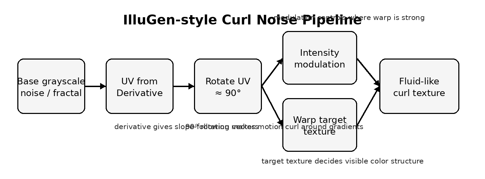
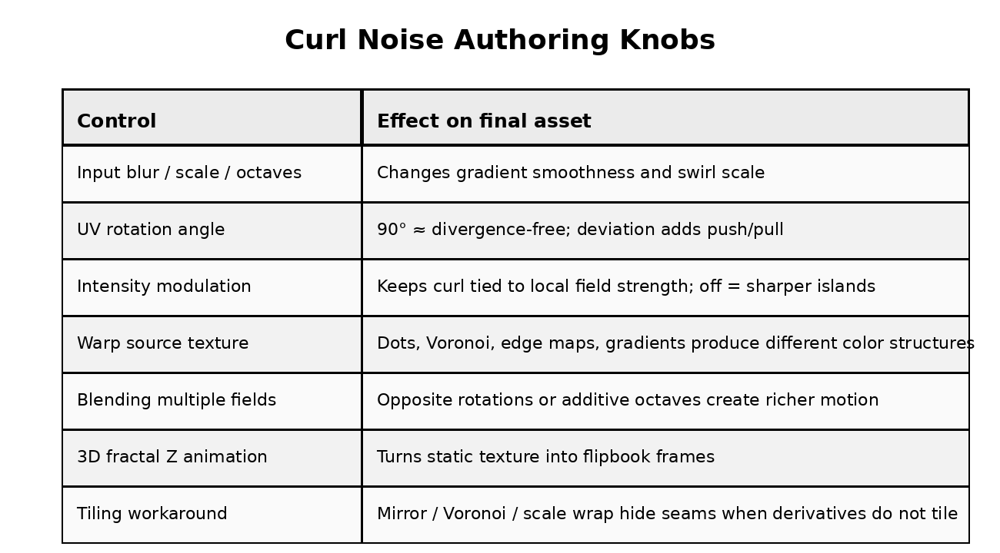

# Curl Noise 资产制作流程

:::concept-card
title: Curl Noise 资产制作流程
summary: 在 IlluGen 一类节点工具中，把灰度噪声转成 derivative UV，再通过旋转、强度调制、扭曲、混合、动画和 tiling 处理生成可用于实时 VFX 的资产。
why: 文章中的重点不是单一公式，而是如何把 curl noise 变成可美术控制、可导出、可循环的游戏特效纹理。
key_intuition: 把 curl noise 看成一个“扭曲器”：curl 输入决定流动方向，被扭曲的 source texture 决定最终可见图案。
:::

## 核心流程

:::process-flow
title: IlluGen 中的 curl noise 制作流程
steps:
  - id: target
    label: 准备被扭曲的目标纹理，例如 grid、dots、Voronoi、gradient 或 edge map
  - id: noise
    label: 准备 curl 生成输入，例如 Perlin noise 或 fractal noise
  - id: derivative-uv
    label: 使用 UV from Derivative 从灰度输入推导方向
    depends_on: noise
  - id: rotate
    label: 将 derivative UV 旋转约 90°，从 slope-following 变成 curl-like
    depends_on: derivative-uv
  - id: intensity-mod
    label: 使用反相或 remap 后的 noise 调制 warp intensity
    depends_on: noise
  - id: directional-blur
    label: 将 UV field 接入 directional blur / warp 节点扭曲目标纹理
    depends_on: [target, rotate, intensity-mod]
  - id: export
    label: 继续做混合、动画、tiling 处理，然后导出贴图或 flipbook
    depends_on: directional-blur
:::

## 可整合的制作旋钮

:::compare-table
columns: [制作因素, 调整后主要影响]
rows:
  输入 blur / scale / octaves: [控制导数场平滑度、旋涡大小和细节密度]
  UV rotation angle: [90° 更接近 non-divergent；偏离 90° 会加入 push / pull / pinching]
  intensity modulation: [让扭曲强度跟随局部场强；关闭后会产生更硬的色块和岛状结构]
  source texture: [最终颜色结构主要由被扭曲对象决定，而不只是 curl 输入决定]
  多场混合: [正反旋向、additive octave、多 pass 可以制造更复杂的双向旋涡]
  3D fractal animation: [通过 Z 轴或时间输入生成连续变化的 flipbook]
  tiling workaround: [当 derivative/warp 边界不连续时，用 mirror、Voronoi 或 scale wrap 隐藏接缝]
:::

## 文章中的关键经验

### 1. 模糊、平滑的输入更容易产生旋涡

Curl field 来自局部导数。如果输入噪声过碎、边界过硬，导数变化会突然跳跃；适度 blur、scale 和 octave 控制能让向量场更连续。

### 2. Divergence 可以作为美术控制项

严格的 curl 构造倾向于 non-divergent，但 VFX 不一定总需要数学纯度。把 UV rotation 从 90° 改到 60°、80°、120° 等范围，会引入不同程度的挤压和扩张；关闭或加强 intensity modulation 也会改变颜色岛、边缘和 pinching。

### 3. 被扭曲的 source texture 决定最终图案

同一个 curl field 扭曲 dots、Voronoi、edge-detected noise、gradient 或圆形 mask，会得到完全不同的资产。制作时应该把 curl 输入和 target texture 分开调试。

### 4. 多层混合比单层 curl 更像真实 VFX

可以把一个 curl 输出再次作为输入，或将正旋向与反旋向场相减/相加，或把大尺度 curl 与小尺度 curl 叠加。这样能得到类似 Jupiter 云带、液体纹理、魔法 wisps 或 caustics 的多层结构。

### 5. Flipbook 动画需要时间连续的输入

静态 noise 只能生成单帧纹理。若要导出 animated flipbook，应使用可在第三维或时间轴上连续变化的 fractal/noise 输入，并用 Z position 或时间调制生成序列帧。

### 6. Tiling 不是自动成立

Derivative 和 warp 在纹理边缘需要连续邻域。边界没有足够邻域信息时，curl noise 默认可能出现 seam。文章中提到可用 mirror wrap、Voronoi sampling、scale wrap 等方法隐藏接缝；这些是 workaround，不等同于真正数学连续的 seamless noise。

## 最小制作检查表

1. 目标是静态贴图、循环贴图，还是 flipbook？
2. Curl 输入是否足够平滑？
3. Source texture 是否能产生你想要的颜色结构？
4. UV rotation 是严格接近 90°，还是故意加入 divergence？
5. 是否需要正反旋向或多尺度 octave 混合？
6. 导出到游戏时是否需要 tiling、压缩和帧数控制？

:::quiz
title: Curl Noise 制作复习
questions:
  - question: 为什么同一个 curl field 扭曲 dots 和 Voronoi 会产生不同观感？
    answer: 因为 curl field 主要提供位移方向和强度，最终可见颜色与边缘结构来自被重采样的 source texture。
  - question: 为什么 90° rotation 常被当作 curl noise 的关键设置？
    answer: 它把 slope-following derivative 方向转成绕坡度运动的方向，并更接近 non-divergent field。
  - question: 为什么 tiling 可能失败？
    answer: derivative/warp 需要边界外或边界另一侧的连续邻域信息；普通纹理坐标边缘不连续时会出现 seam。
:::

## 相关知识

- Curl Noise
- 程序化 VFX 纹理
- Texture Warping
- Flipbook VFX
- Seamless Noise
