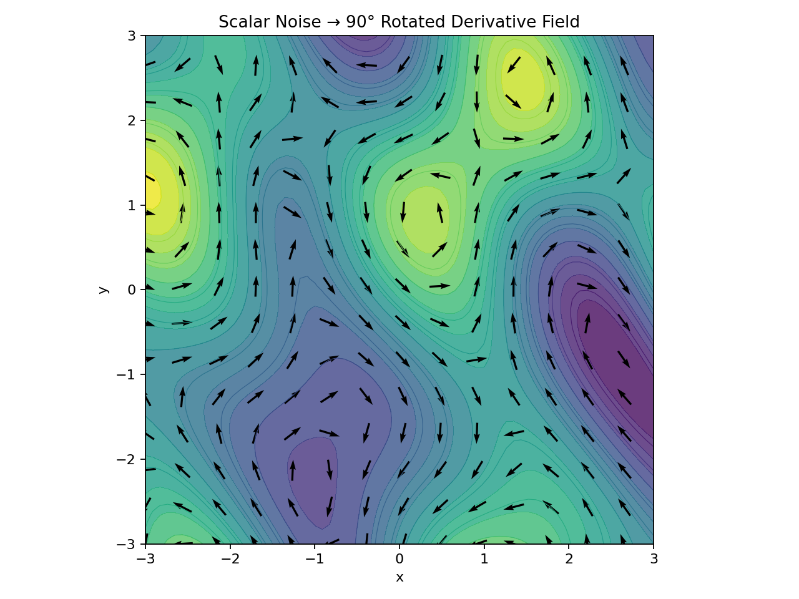

# Curl Noise



:::concept-card
title: Curl Noise
summary: 从标量噪声的局部变化构造旋转向量场，用来生成类似流体的旋涡、流动和有机纹理运动。
why: 它可以在不运行完整流体模拟的情况下，为实时 VFX 提供便宜、可调、视觉上接近流体的运动结构。
key_intuition: 普通梯度会沿着噪声的坡度走；curl field 把这个方向旋转约 90°，让像素绕着坡度转。
:::

## 定义

在二维情况下，可以从一张灰度噪声高度图 `N(x, y)` 出发，估计每个像素附近的局部变化方向。梯度方向表示“往哪里上坡/下坡”。如果把这个方向旋转 90°，得到的向量就不再沿坡度移动，而是绕着等高线移动，因此容易产生旋涡。

常见的二维形式可以写作：

```text
F(x, y) = ( ∂N/∂y, -∂N/∂x )
```

这里不使用 `expression-visualizer`，因为该表达式描述的是二维向量场和符号导数，不是当前支持的 2D 曲线或 3D 标量曲面。

## 它解决的问题

完整流体模拟需要速度场、压力投影、边界条件、时间积分和稳定性处理。Curl noise 不替代这些物理过程，但它能在贴图空间中生成“像液体一样卷曲”的运动。对于魔法能量、烟雾扰动、液体纹理、火焰细节、caustics 扭曲等实时特效，这种近似通常足够有效。

## Divergence 与 Curl 的关系

- **Curl** 关注局部旋转：像素是否绕某个区域打转。
- **Divergence** 关注局部扩张或收缩：像素是否从某点向外散开，或向某点挤压。
- 纯粹 90° 旋转的构造通常更接近 non-divergent field，即不会明显制造“凭空挤出/吸入”的体积感。
- 在美术制作中，适度引入 divergence 反而可能更自然，因为它会产生 pinch、island、pull/push 等更强烈的颜色结构。

## 最小例子

1. 生成一张较平滑的灰度噪声。
2. 对灰度噪声估计局部导数。
3. 将导数方向旋转约 90°。
4. 把该二维向量当作 UV offset 或 warp field。
5. 用它扭曲 grid、dots、Voronoi、gradient 或 edge map。

:::process-flow
title: Curl Noise 的概念流程
steps:
  - id: scalar-noise
    label: 准备标量噪声 N(x, y)
  - id: derivative
    label: 估计局部导数，得到坡度方向
    depends_on: scalar-noise
  - id: rotate
    label: 将方向旋转约 90°，形成绕坡度运动的向量场
    depends_on: derivative
  - id: warp
    label: 用向量场重采样目标纹理
    depends_on: rotate
  - id: art-direct
    label: 调整强度、尺度、模糊、颜色和混合方式
    depends_on: warp
:::

## 常见误区

- **把 curl noise 当成颜色图。** 更准确地说，它常作为 vector field / UV offset 使用；最终颜色取决于被扭曲的 source texture。
- **认为 90° 永远最好。** 90° 更接近数学上的 curl 构造；偏离它会引入 divergence，可能更适合某些美术效果。
- **忽略输入平滑度。** 过硬或过碎的输入会让导数场出现尖锐跳变，旋涡可能变脏。
- **把视觉近似误认为模拟。** Curl noise 是贴图空间技巧，不会自动满足真实流体的质量守恒、边界碰撞和时间连续性。

## 相关知识

- 程序化 VFX 纹理
- 向量场纹理扭曲
- Flow Map
- Divergence / Curl
- Flipbook VFX

## 复习问题

1. 为什么把梯度方向旋转 90° 会更容易形成旋涡？
2. Curl noise 为什么通常比完整流体模拟更适合离线生成 VFX 贴图？
3. 90° UV rotation 和偏离 90° 的 rotation 在视觉上有什么差异？
